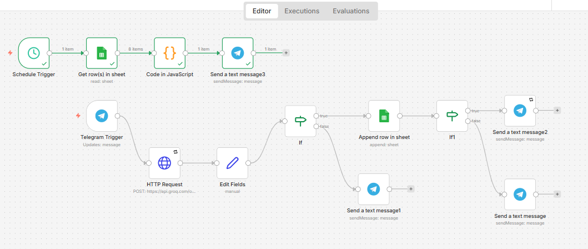

# Agentic AI Personal Expense Ledger & Analytics Pipeline

A self-hosted automation system built on n8n, Groq LLM models, and the Telegram Bot API. It converts free-text expense messages into structured ledger entries in Google Sheets, with real-time budget alerts and a weekly automated spending report.

---

## Overview

Instead of opening a spreadsheet or app, you text a Telegram bot naturally (e.g. *"Spent 350 on coffee at Starbucks"*). An LLM extracts amount, category, and vendor, validates the message, writes it to a ledger, and fires a high-value purchase alert if it crosses a threshold. A separate scheduled workflow reads the full ledger every Sunday and sends a categorized spending summary.

---

## Visual Architecture



## Architecture

Two independent, decoupled workflows:

**Workflow 1 — Real-Time Ingestion**
```
Telegram Trigger → Groq API → If Node (Safety Filter) → Google Sheets → If Node (Risk Gate) → Telegram Notification
```

**Workflow 2 — Batch Reporting**
```
Schedule Trigger → Google Sheets (Read All) → Code Node (Aggregation Loop) → Telegram Broadcast
```

---

## Features

| Feature | Description |
|---|---|
| Frictionless logging | Log expenses via natural Telegram messages, no app or form |
| Contextual categorization | LLM infers category and normalizes vendor name from casual phrasing |
| Budget alerts | Real-time Telegram notification when a single transaction exceeds a configured threshold (e.g. ₹5,000) |
| Automated weekly reports | Scheduled job aggregates the ledger and sends a spending breakdown every Sunday |

---

## Tech Stack

- **Orchestration:** n8n (self-hosted)
- **AI/LLM:** Groq API (open-source models)
- **Messaging:** Telegram Bot API, Ngrok (tunneling)
- **Storage:** Google Sheets + Drive API (OAuth 2.0)
- **Processing:** JavaScript (ES6+), JSON

---

## Implementation Guide

### Phase 1 — Real-Time Ingestion
1. **Telegram bot setup** — created via `@BotFather` to receive incoming chat events.
2. **Tunneling** — Ngrok exposes the local n8n webhook (`http://localhost:5678`) over HTTPS for Telegram's webhook requirements.
3. **Groq integration** — an HTTP Request node calls Groq's API with a system prompt enforcing a fixed JSON schema: `amount`, `category`, `vendor`.
4. **Deserialization** — inline JavaScript (`JSON.parse()`) unpacks Groq's string response into usable data fields for downstream nodes.

### Phase 2 — Filtering & Ledger Routing
1. **Input safety filter (If node)** — rejects non-financial messages (empty `amount`) before they reach the sheet; sends the user a warning on the false branch.
2. **Google Sheets integration** — OAuth 2.0 credentials authorize writes to a ledger sheet (`ExpenseTracker`).
3. **Budget escalation gate (second If node)** — transactions under ₹5,000 get a standard confirmation; transactions at or above ₹5,000 trigger a 🚨 budget alert message instead.

### Phase 3 — Automated Reporting
1. **Schedule trigger** — a cron node runs the second workflow every Sunday evening.
2. **Aggregation (Code node)** — a JavaScript loop scans all ledger rows, builds per-category totals, and computes total spend.
3. **Broadcast** — the formatted summary is sent to a hardcoded Telegram chat ID.